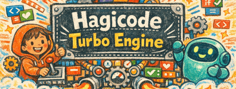

# HagiCode

  <a href="./README.md">English</a> ·
  <a href="./README.zh-CN.md">简体中文</a> ·
  <a href="./README.zh-Hant.md">繁體中文</a> ·
  <a href="./README.ja-JP.md">日本語</a> ·
  <a href="./README.ko-KR.md">한국어</a> ·
  <a href="./README.de-DE.md">Deutsch</a> ·
  <a href="./README.fr-FR.md">Français</a> ·
  <a href="./README.es-ES.md">Español</a> ·
  <a href="./README.pt-BR.md">Português (Brasil)</a> ·
  <a href="./README.ru-RU.md">Русский</a>

<strong>HagiCode는 AI 코딩 도구, 게임화된 피드백 시스템, 그리고 완전한 개발 워크스페이스를 하나의 플랫폼에 결합한 제품입니다.</strong>

저장소 이해, 제안, 구현, 커밋, 지식 축적, 피드백까지 소프트웨어 개발 전 과정을 AI와 함께 연결합니다.

 
 

<a href="https://hagicode.com/">웹사이트</a>
·
<a href="https://docs.hagicode.com/ko-KR/product-overview/">제품 개요</a>
·
<a href="https://hagicode.com/desktop/">Desktop</a>
·
<a href="https://hagicode.com/container/">Container</a>
·
<a href="https://apps.microsoft.com/detail/9N3PM0N3SVDW">Windows Store</a>
·
<a href="https://docs.hagicode.com/ko-KR/blog/">블로그</a>

 
 

---

## Windows Store And Add-ons

기본 앱, Bundle 구성, DLC 관계를 한눈에 확인할 수 있습니다.

  

| 미리보기 | 제품 | 역할 | 동작 |
| --- | --- | --- | --- |
|  | **HagiCode for Windows** | Current public entry point for the desktop app. The Steam main application entry has been retired. | [Open Windows Store](https://apps.microsoft.com/detail/9N3PM0N3SVDW) · [Desktop downloads](https://hagicode.com/desktop/) · [Steam status FAQ](https://docs.hagicode.com/faq/steam-distribution-status/) |
|  | **Hagicode Plus** | Bundle and upgrade guidance remains available through the docs site. | [Read Hagicode Plus docs](https://docs.hagicode.com/bundles/hagicode-plus/) |
|  | **Turbo Engine DLC** | DLC guidance for higher concurrency and customization remains available through the docs site. | [Read Turbo Engine DLC docs](https://docs.hagicode.com/dlc/turbo-engine-dlc/) |

## 왜 HagiCode인가

- **제안 중심 AI 코딩**: `OpenSpec`이 범위, 작업, 영향 분석, 검증, 실행을 연결해 복잡한 작업이 무작정 수정으로 흐르지 않게 합니다.
- **유연한 Agent 및 모델 라우팅**: 주요 Agent CLI와 `OmniRoute`를 통해 상호작용 계층과 모델 계층을 분리해 선택할 수 있습니다.
- **완전한 개발 워크스페이스**: `MonoSpecs`, `Skills`, `Vault`, `AI Compose Commit`, `code-server`가 멀티 리포지토리 작업, 지식 축적, 마무리 단계를 하나의 시스템에 담습니다.
- **실제 신호 기반 게임화 피드백**: 업적, 일일 리포트, 효율 배수, token throughput으로 장시간 AI 작업을 더 쉽게 파악하고 관리할 수 있습니다.

  

## 빠른 링크

- [웹사이트](https://hagicode.com/)
- [제품 개요](https://docs.hagicode.com/ko-KR/product-overview/)
- [Desktop](https://hagicode.com/desktop/)
- [Container](https://hagicode.com/container/)
- [Windows Store](https://apps.microsoft.com/detail/9N3PM0N3SVDW) for the current Windows desktop entry point
- [Steam status FAQ](https://docs.hagicode.com/faq/steam-distribution-status/) for why the Steam main application is no longer the primary channel
- [블로그](https://docs.hagicode.com/ko-KR/blog/)
- [빠른 시작 가이드](https://docs.hagicode.com/ko-KR/quick-start/conversation-session/)

## 주요 프로젝트

- **[site](https://github.com/HagiCode-org/site)** - 공식 마케팅 사이트이자 공개 GitHub 랜딩 저장소
- **[desktop](https://github.com/HagiCode-org/desktop)** - 로컬 우선 HagiCode 워크플로를 위한 데스크톱 클라이언트
- **[container](https://github.com/HagiCode-org/container)** - 팀과 서버 환경을 위한 셀프호스팅 배포 경로
- **[docs](https://github.com/HagiCode-org/docs)** - 공식 제품 개요와 가이드를 제공하는 문서 사이트

## 최신 블로그 글

| 날짜 | 제목 |
|------|------|
| 2026/4/18 | [Claude Code, Codex 등 Agent CLI의 자동 재시도 구현 방법](https://docs.hagicode.com/ko-KR/blog/2026-02-11-agent-cli-automatic-retry/) |
| 2026/4/17 | [SQLite 샤딩 실무: 세 가지 샤딩 전략의 심층 비교](https://docs.hagicode.com/ko-KR/blog/2026-04-17-sqlite-sharding-strategies-comparison/) |
| 2026/4/16 | [GitHub Actions로 Steam 릴리스 자동화하기](https://docs.hagicode.com/ko-KR/blog/2026-04-16-steam-release-automation-github-actions/) |
| 2026/4/15 | [저비용 클라우드 서버로 빠른 다운로드 배포站 구축하기](https://docs.hagicode.com/ko-KR/blog/2026-04-15-low-cost-cloud-server-download-distribution-station/) |
| 2026/4/14 | [Hermes Agent 통합 실무: 프로토콜부터 프로덕션까지](https://docs.hagicode.com/ko-KR/blog/2026-04-14-hermes-agent-integration-practice/) |
| 2026/4/13 | [Hermes 설치 및 사용 방법: 로컬 CLI부터 Feishu 통합까지의 빠른 시작](https://docs.hagicode.com/ko-KR/blog/2026-04-13-how-to-install-and-use-hermes/) |
| 2026/4/13 | [VSCode와 code-server: 브라우저 기반 코드 편집 솔루션 선택하기](https://docs.hagicode.com/ko-KR/blog/2026-04-13-vscode-web-integration-browser-editing/) |
| 2026/4/12 | [브라우저에서 빠른 코드 편집: VSCode 웹 통합 실전](https://docs.hagicode.com/ko-KR/blog/2026-04-12-vscode-web-integration-browser-editing/) |
| 2026/4/11 | [보더 라이트 스윕 애니메이션 효과 만들기 가이드](https://docs.hagicode.com/ko-KR/blog/2026-04-11-border-light-animation-effect/) |
| 2026/4/10 | [AI 시대를 위한 크로스 프로젝트 지식 베이스 구축 - Vault 시스템](https://docs.hagicode.com/ko-KR/blog/2026-04-10-vault-system-ai-knowledge-base/) |

## 지원

- [문서](https://docs.hagicode.com/ko-KR/)
- [블로그](https://docs.hagicode.com/ko-KR/blog/)
- [GitHub Organization](https://github.com/HagiCode-org)
- [Issues](https://github.com/HagiCode-org/site/issues)
- [AI Replacement Calculator](https://cost.hagicode.com)

전체 제품 스토리를 더 살펴보고 싶다면 [hagicode.com](https://hagicode.com/)에서 시작해 당신의 워크플로에 맞는 경로를 선택하세요.
